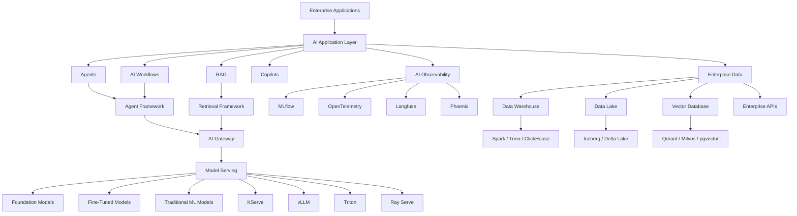
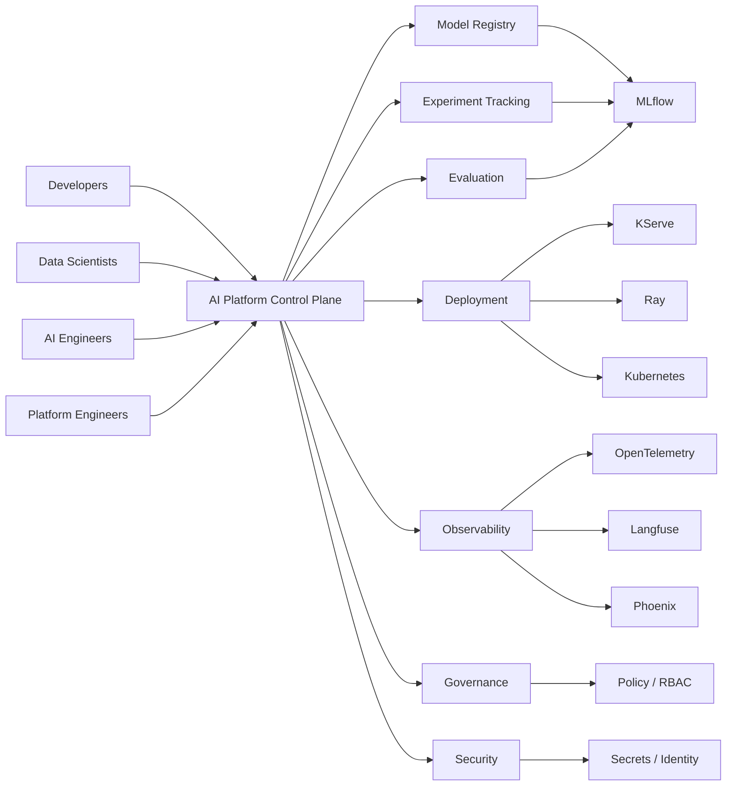

# Awesome-Enterprise-AI-Platform

# 🏢 Top Enterprise AI Platforms


A curated list of **Enterprise AI Platforms**, AI/ML platforms, GenAI platforms, AI application platforms, MLOps platforms, model development platforms, AI governance platforms, and open-source alternatives for building, deploying, governing, and operating AI at enterprise scale.


> **Open-source software is the primary focus of this repository.** The goal is to curate not only commercial Enterprise AI Platforms, but also the open-source infrastructure that can be combined to build self-hosted, private-cloud, sovereign-AI, and vendor-neutral alternatives.


Enterprise AI platforms typically combine multiple capabilities:


* 🤖 Foundation Models & GenAI

* 🧠 Machine Learning

* 🧪 Model Development

* ⚙️ Model Training & Fine-Tuning

* 🚀 Model Serving

* 🔗 AI Agents

* 📚 RAG & Enterprise Search

* 📊 Data Science

* 🧬 MLOps / LLMOps

* 🔍 AI Observability

* 🛡️ AI Governance & Security

* 👥 Enterprise Collaboration

* ☁️ Cloud & Hybrid Deployment

* 🏢 Private / On-Premises AI

* 💰 AI Cost Management


---


## 📑 Table of Contents


* [☁️ SaaS/Hosted Platforms](#️-saashosted-platforms)

* [🌍 Open-Source](#-open-source)

* [🧪 Open-Source End-to-End AI Platforms](#-open-source-end-to-end-ai-platforms)

* [⚙️ Open-Source MLOps Platforms](#️-open-source-mlops-platforms)

* [🤖 Open-Source GenAI & LLM Platforms](#-open-source-genai--llm-platforms)

* [🚀 Open-Source Model Serving](#-open-source-model-serving)

* [🔗 Open-Source AI Agent Platforms](#-open-source-ai-agent-platforms)

* [📚 Open-Source RAG & Enterprise Search](#-open-source-rag--enterprise-search)

* [📊 Open-Source Data & Analytics Infrastructure](#-open-source-data--analytics-infrastructure)

* [🛡️ Open-Source AI Governance & Observability](#️-open-source-ai-governance--observability)

* [☸️ Open-Source AI Infrastructure](#️-open-source-ai-infrastructure)

* [🏗️ Enterprise AI Architecture](#️-enterprise-ai-architecture)

* [🔄 Commercial Platform → Open-Source Equivalent](#-commercial-platform--open-source-equivalent)

* [🔍 Commercial vs Open-Source](#-commercial-vs-open-source)

* [⭐ Recommended Open-Source Stacks](#-recommended-open-source-stacks)

* [🚧 Where Open Source Still Has Gaps](#-where-open-source-still-has-gaps)

* [🤝 How to Contribute](#-how-to-contribute)

* [⚠️ Disclaimer](#️-disclaimer)


---


# ☁️ SaaS/Hosted Platforms


Commercial and hosted platforms providing combinations of AI development, model management, data science, MLOps, GenAI, AI agents, governance, deployment and enterprise infrastructure.


| Platform                                                                                 | Description                                                                                                                                     | Primary Focus                |

| ---------------------------------------------------------------------------------------- | ----------------------------------------------------------------------------------------------------------------------------------------------- | ---------------------------- |

| [Microsoft Foundry](https://azure.microsoft.com/en-us/products/ai-foundry/)              | Microsoft's unified enterprise AI platform for models, agents, tools, evaluation, monitoring, governance and AI application development.        | Enterprise AI / Agents       |

| [Google Vertex AI](https://cloud.google.com/vertex-ai)                                   | Google Cloud's end-to-end AI platform covering foundation models, ML development, agents, evaluation, deployment and governance.                | AI/ML Platform               |

| [Amazon Bedrock](https://aws.amazon.com/bedrock/)                                        | Fully managed AWS service for building generative AI applications using foundation models, agents, RAG and enterprise controls.                 | GenAI / Foundation Models    |

| [Databricks AI](https://www.databricks.com/product/artificial-intelligence)              | AI platform integrated with the Databricks Data Intelligence Platform for model development, GenAI, agents, evaluation, serving and governance. | Data + AI                    |

| [Snowflake Cortex](https://www.snowflake.com/en/product/cortex/)                         | AI capabilities integrated directly into Snowflake for enterprise data, LLM inference, search and AI applications.                              | Data Cloud + AI              |

| [C3 AI](https://c3.ai/)                                                                  | Enterprise AI application platform for developing and deploying AI applications across industries and business functions.                       | Enterprise AI Applications   |

| [DataRobot AI Platform](https://www.datarobot.com/platform/)                             | Enterprise AI platform covering AI development, AutoML, GenAI, deployment, monitoring and governance.                                           | AI/ML + Governance           |

| [H2O AI Cloud](https://h2o.ai/platform/)                                                 | Enterprise AI platform providing machine learning, AutoML, GenAI, LLM applications and MLOps capabilities.                                      | AI/ML + GenAI                |

| [SAS Viya](https://www.sas.com/en_us/software/viya.html)                                 | Enterprise analytics and AI platform covering data science, machine learning, model management, governance and analytics.                       | Enterprise Analytics         |

| [Domino Data Lab](https://domino.ai/platform)                                            | Enterprise data science and AI platform for developing, deploying, governing and managing AI workloads across hybrid infrastructure.            | Enterprise Data Science      |

| [IBM watsonx](https://www.ibm.com/watsonx)                                               | Enterprise AI platform covering AI development, foundation models, governance and data.                                                         | Enterprise AI                |

| [Oracle AI](https://www.oracle.com/artificial-intelligence/)                             | Enterprise AI services integrated with Oracle Cloud and enterprise applications and databases.                                                  | Enterprise AI                |

| [SAP Business AI](https://www.sap.com/products/artificial-intelligence.html)             | AI capabilities integrated across SAP's enterprise applications and business processes.                                                         | Business AI                  |

| [NVIDIA AI Enterprise](https://www.nvidia.com/en-us/data-center/products/ai-enterprise/) | Enterprise software stack for developing, deploying and operating AI workloads on NVIDIA infrastructure.                                        | AI Infrastructure            |

| [Palantir AIP](https://www.palantir.com/platforms/aip/)                                  | Enterprise AI platform integrating foundation models with organizational data, workflows, agents and operational systems.                       | AI Applications / Agents     |

| [Snowflake Cortex AI](https://www.snowflake.com/en/product/cortex/)                      | AI and ML capabilities running close to enterprise data inside Snowflake.                                                                       | Data + AI                    |

| [Scale AI](https://scale.com/)                                                           | Enterprise AI platform combining data, evaluation, model development and AI application infrastructure.                                         | AI Data / Evaluation         |

| [Weights & Biases](https://wandb.ai/)                                                    | AI development and MLOps platform covering experiments, models, datasets, evaluation and production AI workflows.                               | MLOps                        |

| [Dataiku](https://www.dataiku.com/)                                                      | Enterprise AI and data science platform for collaborative analytics, ML, GenAI and governance.                                                  | Enterprise AI / Data Science |

| [Altair RapidMiner](https://altair.com/rapidminer)                                       | Enterprise data analytics and AI platform supporting data preparation, machine learning and AI workflows.                                       | Data Science                 |

| [Cloudera AI](https://www.cloudera.com/products/machine-learning.html)                   | Enterprise AI/ML development and deployment environment integrated with the Cloudera data platform.                                             | Enterprise Data + AI         |

| [HPE Ezmeral AI](https://www.hpe.com/us/en/ai.html)                                      | Enterprise AI infrastructure and software for large-scale AI development and deployment.                                                        | AI Infrastructure            |

| [Dell AI Solutions](https://www.dell.com/en-us/dt/solutions/artificial-intelligence.htm) | Enterprise AI infrastructure and solutions for private and hybrid AI deployments.                                                               | Private AI                   |

| [Baidu AI Cloud](https://cloud.baidu.com/)                                               | Cloud AI platform providing enterprise AI, model services and ML infrastructure.                                                                | Cloud AI                     |

| [Alibaba Cloud AI](https://www.alibabacloud.com/en/solutions/ai)                         | Cloud AI ecosystem covering foundation models, model services, ML and enterprise AI applications.                                               | Cloud AI                     |

| [Tencent Cloud AI](https://www.tencentcloud.com/products/tiia)                           | Enterprise AI services and infrastructure across model development and deployment.                                                              | Cloud AI                     |


---


# 🌍 Open-Source


Open-source projects that can collectively reproduce many capabilities found in commercial Enterprise AI Platforms.


> Unlike commercial platforms, the open-source ecosystem is **modular**. There is rarely one project that perfectly replaces an entire enterprise platform. Instead, organizations can assemble a platform from Kubernetes, Kubeflow, MLflow, Ray, KServe, model runtimes, data infrastructure, AI gateways and application frameworks.


---


# 🧪 Open-Source End-to-End AI Platforms


| Project                                                        | Description                                                                                                                   | Best Use               |

| -------------------------------------------------------------- | ----------------------------------------------------------------------------------------------------------------------------- | ---------------------- |

| [Kubeflow](https://github.com/kubeflow/kubeflow)               | Kubernetes-native ecosystem for data science, ML training, pipelines, model serving and AI workloads.                         | Enterprise AI Platform |

| [MLflow](https://github.com/mlflow/mlflow)                     | Open-source AI engineering platform covering ML lifecycle management, LLMs, agents, evaluation, observability and deployment. | AI/ML Lifecycle        |

| [ClearML](https://github.com/clearml/clearml)                  | Open-source suite covering experiment management, data management, orchestration, pipelines and model serving.                | MLOps                  |

| [Open Data Hub](https://github.com/opendatahub-io/opendatahub) | Open-source AI/ML platform distribution for Kubernetes/OpenShift environments.                                                | Enterprise AI          |

| [H2O-3](https://github.com/h2oai/h2o-3)                        | Open-source machine-learning platform supporting distributed ML and AutoML.                                                   | Machine Learning       |

| [Elyra](https://github.com/elyra-ai/elyra)                     | Visual AI workflow development environment that integrates with notebook and pipeline ecosystems.                             | AI Workflows           |

| [Polyaxon](https://github.com/polyaxon/polyaxon)               | Open-source-oriented platform for machine learning and deep-learning workflows.                                               | ML Platform            |

| [Metaflow](https://github.com/Netflix/metaflow)                | Framework for building and operating data science and ML workflows.                                                           | Data Science           |

| [Flyte](https://github.com/flyteorg/flyte)                     | Kubernetes-native workflow orchestration platform for data and ML workloads.                                                  | ML Orchestration       |

| [ZenML](https://github.com/zenml-io/zenml)                     | Open-source MLOps framework for creating reproducible ML pipelines.                                                           | MLOps                  |


Kubeflow describes itself as a modular Kubernetes-native stack for data and AI workloads, with subprojects spanning notebooks, training, pipelines, model registries, dashboards and serving-related infrastructure. ([kubeflow.org](https://www.kubeflow.org/docs/started/introduction/))


MLflow has expanded from traditional experiment tracking into an AI engineering platform covering LLMs, agents, observability, evaluation, prompt management, AI gateway capabilities and deployment. ([mlflow.org](https://mlflow.org/))


---


# ⚙️ Open-Source MLOps Platforms


| Project                                             | Description                                                                                     | Primary Capability    |

| --------------------------------------------------- | ----------------------------------------------------------------------------------------------- | --------------------- |

| [MLflow](https://github.com/mlflow/mlflow)          | Model lifecycle, experiment tracking, evaluation, registry, deployment and GenAI observability. | MLOps / LLMOps        |

| [Kubeflow](https://github.com/kubeflow/kubeflow)    | Kubernetes-native ML platform ecosystem.                                                        | Enterprise MLOps      |

| [ClearML](https://github.com/clearml/clearml)       | Experiment management, data management, pipelines, orchestration and serving.                   | Full MLOps            |

| [DVC](https://github.com/iterative/dvc)             | Data and model version control.                                                                 | Data/Model Versioning |

| [Metaflow](https://github.com/Netflix/metaflow)     | Data science and ML workflow framework.                                                         | ML Workflows          |

| [Flyte](https://github.com/flyteorg/flyte)          | Scalable workflow orchestration for data and ML.                                                | ML Pipelines          |

| [Feast](https://github.com/feast-dev/feast)         | Open-source feature store for ML systems.                                                       | Feature Store         |

| [ZenML](https://github.com/zenml-io/zenml)          | Framework for reproducible and production-ready ML pipelines.                                   | MLOps                 |

| [Apache Airflow](https://github.com/apache/airflow) | Workflow orchestration platform widely used for data and ML pipelines.                          | Data/ML Orchestration |

| [Dagster](https://github.com/dagster-io/dagster)    | Data orchestration framework useful for AI and ML pipelines.                                    | Data Orchestration    |

| [Prefect](https://github.com/PrefectHQ/prefect)     | Workflow orchestration for data and AI systems.                                                 | Workflow Automation   |


---


# 🤖 Open-Source GenAI & LLM Platforms


| Project                                                      | Description                                                                                         | Best Use             |

| ------------------------------------------------------------ | --------------------------------------------------------------------------------------------------- | -------------------- |

| [Dify](https://github.com/langgenius/dify)                   | Open-source LLM application platform supporting workflows, agents, RAG, model providers and LLMOps. | GenAI Platform       |

| [Open WebUI](https://github.com/open-webui/open-webui)       | Self-hosted AI interface supporting local and remote LLMs.                                          | Enterprise AI Portal |

| [LibreChat](https://github.com/danny-avila/LibreChat)        | Open-source multi-provider AI platform with support for multiple LLMs and AI tools.                 | Enterprise Chat      |

| [Flowise](https://github.com/FlowiseAI/Flowise)              | Visual builder for LLM applications, workflows and agents.                                          | AI Applications      |

| [AnythingLLM](https://github.com/Mintplex-Labs/anything-llm) | Private AI workspace focused on documents, RAG and enterprise knowledge.                            | Private AI           |

| [RAGFlow](https://github.com/infiniflow/ragflow)             | Open-source RAG engine focused on enterprise document understanding.                                | Enterprise RAG       |

| [Onyx](https://github.com/onyx-dot-app/onyx)                 | Open-source enterprise search and AI assistant platform.                                            | Enterprise Search    |

| [OpenLLM](https://github.com/bentoml/OpenLLM)                | Open-source ecosystem for serving and deploying LLMs.                                               | LLM Deployment       |

| [LocalAI](https://github.com/mudler/LocalAI)                 | Self-hosted OpenAI-compatible AI inference server supporting multiple model types.                  | Private AI           |

| [Ollama](https://github.com/ollama/ollama)                   | Local model runtime simplifying deployment of open models.                                          | Local AI             |


Dify combines workflows, model-provider integrations, RAG, agents, LLMOps and APIs in one open-source application platform. ([github.com](https://github.com/langgenius/dify))


---


# 🚀 Open-Source Model Serving


| Project                                                                      | Description                                                                          | Best Use                 |

| ---------------------------------------------------------------------------- | ------------------------------------------------------------------------------------ | ------------------------ |

| [vLLM](https://github.com/vllm-project/vllm)                                 | High-throughput inference and serving engine for modern AI models.                   | LLM Serving              |

| [KServe](https://github.com/kserve/kserve)                                   | Kubernetes-native model inference platform.                                          | Enterprise Model Serving |

| [Ray Serve](https://github.com/ray-project/ray)                              | Distributed model serving framework built on Ray.                                    | Distributed AI           |

| [NVIDIA Triton](https://github.com/triton-inference-server/server)           | Production inference server supporting multiple ML frameworks.                       | GPU Inference            |

| [SGLang](https://github.com/sgl-project/sglang)                              | High-performance LLM serving and structured generation framework.                    | LLM Inference            |

| [llama.cpp](https://github.com/ggml-org/llama.cpp)                           | Lightweight inference ecosystem for running LLMs across CPUs, GPUs and edge devices. | Local / Edge AI          |

| [Ollama](https://github.com/ollama/ollama)                                   | Simple local LLM runtime.                                                            | Developer AI             |

| [BentoML](https://github.com/bentoml/BentoML)                                | Framework for packaging and deploying AI models as production services.              | Model Deployment         |

| [Hugging Face TGI](https://github.com/huggingface/text-generation-inference) | Specialized inference server for text-generation models.                             | LLM Serving              |

| [Hugging Face TEI](https://github.com/huggingface/text-embeddings-inference) | Specialized inference server for embedding models.                                   | Embedding Serving        |


---


# 🔗 Open-Source AI Agent Platforms


| Project                                                         | Description                                                               | Best Use            |

| --------------------------------------------------------------- | ------------------------------------------------------------------------- | ------------------- |

| [LangGraph](https://github.com/langchain-ai/langgraph)          | Framework for building stateful, controllable agent workflows.            | Enterprise Agents   |

| [LangChain](https://github.com/langchain-ai/langchain)          | Broad ecosystem for building LLM-powered applications and agents.         | AI Applications     |

| [LlamaIndex](https://github.com/run-llama/llama_index)          | Data and agent framework for connecting LLMs with enterprise information. | RAG / Agents        |

| [Haystack](https://github.com/deepset-ai/haystack)              | Production-oriented framework for RAG, agents, search and LLM pipelines.  | Enterprise AI       |

| [AutoGen](https://github.com/microsoft/autogen)                 | Framework for multi-agent AI systems.                                     | Multi-Agent AI      |

| [Semantic Kernel](https://github.com/microsoft/semantic-kernel) | SDK for integrating AI models, plugins, tools and agent workflows.        | Enterprise AI       |

| [CrewAI](https://github.com/crewAIInc/crewAI)                   | Framework for orchestrating collaborative AI agents.                      | Multi-Agent Systems |

| [PydanticAI](https://github.com/pydantic/pydantic-ai)           | Typed Python framework for production AI agents.                          | Agent Development   |

| [Agno](https://github.com/agno-agi/agno)                        | Framework for building AI agents and multi-agent systems.                 | Agents              |

| [DSPy](https://github.com/stanfordnlp/dspy)                     | Framework for programming and optimizing language-model systems.          | AI Optimization     |

| [Mastra](https://github.com/mastra-ai/mastra)                   | TypeScript framework for AI agents and workflows.                         | TypeScript AI       |


---


# 📚 Open-Source RAG & Enterprise Search


| Project                                                        | Description                                                             | Best Use             |

| -------------------------------------------------------------- | ----------------------------------------------------------------------- | -------------------- |

| [LlamaIndex](https://github.com/run-llama/llama_index)         | Data framework for RAG and AI applications.                             | Enterprise Knowledge |

| [Haystack](https://github.com/deepset-ai/haystack)             | Modular retrieval and AI pipeline framework.                            | Enterprise Search    |

| [RAGFlow](https://github.com/infiniflow/ragflow)               | Full-stack RAG engine focused on document understanding.                | Document AI          |

| [Vespa](https://github.com/vespa-engine/vespa)                 | Search and serving platform supporting vector retrieval and ranking.    | Large-Scale Search   |

| [OpenSearch](https://github.com/opensearch-project/OpenSearch) | Open-source search engine with vector and semantic-search capabilities. | Enterprise Search    |

| [Apache Solr](https://github.com/apache/solr)                  | Open-source search platform built on Apache Lucene.                     | Enterprise Search    |

| [Qdrant](https://github.com/qdrant/qdrant)                     | Vector database for AI applications.                                    | Vector Search        |

| [Milvus](https://github.com/milvus-io/milvus)                  | Distributed vector database for large-scale AI workloads.               | Vector Search        |

| [Weaviate](https://github.com/weaviate/weaviate)               | Open-source vector database and semantic search engine.                 | RAG                  |

| [pgvector](https://github.com/pgvector/pgvector)               | PostgreSQL extension for vector similarity search.                      | PostgreSQL AI        |


---


# 📊 Open-Source Data & Analytics Infrastructure


Enterprise AI platforms require substantial data infrastructure underneath the AI layer.


| Project                                                | Description                                                    | Equivalent Enterprise Layer |

| ------------------------------------------------------ | -------------------------------------------------------------- | --------------------------- |

| [Apache Spark](https://github.com/apache/spark)        | Distributed data-processing engine.                            | Databricks                  |

| [Trino](https://github.com/trinodb/trino)              | Distributed SQL query engine.                                  | Data Cloud                  |

| [ClickHouse](https://github.com/ClickHouse/ClickHouse) | High-performance analytical database.                          | Analytics Warehouse         |

| [DuckDB](https://github.com/duckdb/duckdb)             | Embedded analytical database.                                  | Local Analytics             |

| [Apache Druid](https://github.com/apache/druid)        | Distributed real-time analytical database.                     | Real-Time Analytics         |

| [Apache Pinot](https://github.com/apache/pinot)        | Distributed real-time OLAP datastore.                          | Real-Time Analytics         |

| [PostgreSQL](https://github.com/postgres/postgres)     | Open-source relational database and AI application data layer. | Enterprise Database         |

| [Apache Iceberg](https://github.com/apache/iceberg)    | Open table format for large analytical datasets.               | Lakehouse                   |

| [Delta Lake](https://github.com/delta-io/delta)        | Open-source storage framework for lakehouse architectures.     | Lakehouse                   |

| [Apache Arrow](https://github.com/apache/arrow)        | Columnar data and interoperability ecosystem.                  | Data Infrastructure         |

| [dbt Core](https://github.com/dbt-labs/dbt-core)       | SQL-based data transformation framework.                       | Data Transformation         |

| [MinIO](https://github.com/minio/minio)                | Object storage compatible with the S3 ecosystem.               | AI Data Storage             |


---


# 🛡️ Open-Source AI Governance & Observability


| Project                                                                        | Description                                                                | Primary Capability     |

| ------------------------------------------------------------------------------ | -------------------------------------------------------------------------- | ---------------------- |

| [MLflow](https://github.com/mlflow/mlflow)                                     | AI observability, evaluation, model lifecycle and AI gateway capabilities. | AI Governance / LLMOps |

| [OpenTelemetry](https://github.com/open-telemetry/opentelemetry-collector)     | Vendor-neutral telemetry infrastructure.                                   | Observability          |

| [Langfuse](https://github.com/langfuse/langfuse)                               | Open-source LLM observability, tracing and evaluation platform.            | LLMOps                 |

| [Arize Phoenix](https://github.com/Arize-ai/phoenix)                           | Open-source AI observability and evaluation platform.                      | AI Observability       |

| [Evidently](https://github.com/evidentlyai/evidently)                          | Open-source ML and AI evaluation and monitoring framework.                 | Model Monitoring       |

| [WhyLabs whylogs](https://github.com/whylabs/whylogs)                          | Open-source data and ML logging library.                                   | Data Monitoring        |

| [Great Expectations](https://github.com/great-expectations/great_expectations) | Data quality and validation framework.                                     | Data Governance        |

| [Guardrails AI](https://github.com/guardrails-ai/guardrails)                   | Framework for validating and controlling LLM outputs.                      | AI Safety              |

| [NeMo Guardrails](https://github.com/NVIDIA-NeMo/Guardrails)                   | Programmable guardrails for conversational AI systems.                     | AI Safety              |

| [Presidio](https://github.com/microsoft/presidio)                              | Open-source framework for detecting and anonymizing sensitive data.        | Privacy / PII          |


---


# 🧠 Open-Source AI Evaluation


| Project                                                                                 | Description                                                               | Best Use         |

| --------------------------------------------------------------------------------------- | ------------------------------------------------------------------------- | ---------------- |

| [MLflow](https://github.com/mlflow/mlflow)                                              | Evaluation and monitoring for ML, LLM and agent systems.                  | Enterprise AI    |

| [Ragas](https://github.com/explodinggradients/ragas)                                    | Evaluation framework focused on RAG and LLM applications.                 | RAG Evaluation   |

| [DeepEval](https://github.com/confident-ai/deepeval)                                    | Open-source framework for evaluating LLM applications.                    | LLM Evaluation   |

| [TruLens](https://github.com/truera/trulens)                                            | Evaluation and observability framework for LLM applications.              | AI Evaluation    |

| [promptfoo](https://github.com/promptfoo/promptfoo)                                     | Testing and evaluation framework for LLM applications.                    | AI Testing       |

| [OpenAI Evals](https://github.com/openai/evals)                                         | Framework for evaluating AI models and systems.                           | Model Evaluation |

| [EleutherAI LM Evaluation Harness](https://github.com/EleutherAI/lm-evaluation-harness) | Framework for evaluating language models against standardized benchmarks. | LLM Benchmarking |


---


# ☸️ Open-Source AI Infrastructure


## Kubernetes


[Kubernetes](https://github.com/kubernetes/kubernetes) provides the underlying orchestration layer for many self-hosted enterprise AI platforms.


```text

Enterprise AI Platform

        │

        ↓

    Kubernetes

        │

 ┌──────┼────────┐

 ↓      ↓        ↓

ML     GenAI    Data

│       │        │

↓       ↓        ↓

MLflow KServe   Spark

│       │        │

└───────┼────────┘

        ↓

      GPUs

```


## Ray


[Ray](https://github.com/ray-project/ray) provides distributed computing capabilities useful for:


* Distributed training

* Model serving

* Data processing

* Hyperparameter optimization

* AI agents

* Reinforcement learning

* GPU workloads


## KServe


[KServe](https://github.com/kserve/kserve) provides Kubernetes-native model serving infrastructure.


## NVIDIA Triton


[NVIDIA Triton Inference Server](https://github.com/triton-inference-server/server) provides a general-purpose inference layer for production AI workloads.


---


# 🏗️ Enterprise AI Architecture


A modern enterprise AI platform can be thought of as a stack:





---


# 🏢 Enterprise AI Control Plane


Commercial enterprise platforms increasingly combine development, deployment, governance and observability under a unified control plane.


A self-hosted architecture can reproduce this concept:





---


# 🔄 Commercial Platform → Open-Source Equivalent


The following are **architectural equivalents**, not exact one-to-one replacements.


| Commercial Platform | Possible Open-Source Stack                                 |

| ------------------- | ---------------------------------------------------------- |

| Microsoft Foundry   | Kubeflow + MLflow + KServe + LangGraph + LiteLLM           |

| Google Vertex AI    | Kubeflow + MLflow + Ray + KServe + Kubernetes              |

| Amazon Bedrock      | LiteLLM + vLLM + KServe + LangGraph + Kubernetes           |

| Databricks AI       | Spark + MLflow + Ray + Iceberg/Delta Lake + Kubernetes     |

| Snowflake Cortex    | PostgreSQL/ClickHouse + MLflow + vLLM + Qdrant + Trino     |

| C3 AI               | Dify + LangGraph + MLflow + enterprise data stack          |

| DataRobot AI Cloud  | MLflow + Kubeflow + AutoML frameworks + KServe             |

| H2O AI Cloud        | H2O-3 + MLflow + Kubeflow + KServe                         |

| SAS Viya            | Kubeflow + MLflow + Spark + Jupyter + model-serving stack  |

| Domino Data Lab     | Kubeflow + MLflow + Jupyter + Kubernetes + KServe          |

| IBM watsonx         | Kubeflow + MLflow + Open WebUI/Dify + KServe               |

| Dataiku             | Jupyter + MLflow + Airflow/Dagster + dbt + Kubernetes      |

| Palantir AIP        | Dify + LangGraph + MLflow + RAG + enterprise data platform |


---


# 🧩 A Fully Open-Source Enterprise AI Platform


One possible architecture:


```text

                    Enterprise Users

                           │

                           ↓

                 ┌──────────────────┐

                 │ Enterprise Portal │

                 └────────┬─────────┘

                          ↓

                  AI Application Layer

                          │

          ┌───────────────┼────────────────┐

          ↓               ↓                ↓

       Agents            RAG            Workflows

          │               │                │

          └───────────────┼────────────────┘

                          ↓

                    AI Gateway

                          │

                 ┌────────┴────────┐

                 ↓                 ↓

            Open Models       Cloud Models

                 │                 │

                 ↓                 ↓

               vLLM            External APIs

                 │

                 ↓

          Kubernetes / Ray

                 │

        ┌────────┼────────┐

        ↓        ↓        ↓

     KServe    MLflow   GPU Cluster

        │        │

        └────────┼────────┘

                 ↓

          Enterprise Data

                 │

      ┌──────────┼──────────┐

      ↓          ↓          ↓

   PostgreSQL  Object     Vector DB

              Storage

```


---


# 🔍 Commercial vs Open-Source


| Capability              | SaaS/Hosted Platforms |          Open-Source Stack |

| ----------------------- | --------------------: | -------------------------: |

| AI/ML development       |                     ✅ |                          ✅ |

| GenAI                   |                     ✅ |                          ✅ |

| Foundation models       |                     ✅ |                          ✅ |

| Model training          |                     ✅ |                          ✅ |

| Fine-tuning             |                     ✅ |                          ✅ |

| AutoML                  |                     ✅ |                          ✅ |

| Model registry          |                     ✅ |                          ✅ |

| Model serving           |                     ✅ |                          ✅ |

| AI agents               |                     ✅ |                          ✅ |

| RAG                     |                     ✅ |                          ✅ |

| Experiment tracking     |                     ✅ |                          ✅ |

| AI evaluation           |                     ✅ |                          ✅ |

| Observability           |                     ✅ |                          ✅ |

| AI governance           |                     ✅ |    ⚠️ Requires integration |

| RBAC                    |                     ✅ |                          ✅ |

| Multi-tenancy           |                     ✅ |   ⚠️ Requires architecture |

| Data lineage            |                     ✅ | ⚠️ Requires multiple tools |

| Compliance tooling      |                     ✅ |    ⚠️ Requires integration |

| Managed GPUs            |                     ✅ |             ❌ Self-managed |

| Automatic scaling       |                     ✅ | ⚠️ Requires infrastructure |

| Private cloud           | ⚠️ Provider dependent |                          ✅ |

| On-premises             | ⚠️ Provider dependent |                          ✅ |

| Data sovereignty        | ⚠️ Provider dependent |                          ✅ |

| Vendor lock-in          |             ⚠️ Higher |                    ✅ Lower |

| Infrastructure control  |            ⚠️ Limited |                     ✅ Full |

| Customization           | ⚠️ Platform dependent |           ✅ Extremely high |

| Operational complexity  |                 ✅ Low |                     ❌ High |

| Infrastructure cost     |        💰 Usage based |    💰 Infrastructure based |

| Engineering requirement |            Low–Medium |                       High |


---


# ⭐ Recommended Open-Source Stacks


## 🥇 1. General-Purpose Enterprise AI Platform


```text

Kubernetes

    +

Kubeflow

    +

MLflow

    +

KServe

    +

vLLM

    +

LangGraph

    +

Qdrant

    +

OpenTelemetry

```


**Best for:**


* Enterprise AI platforms

* Private AI

* Hybrid cloud

* Model lifecycle management

* AI application development


Kubeflow is particularly suitable as the infrastructure foundation because its ecosystem is explicitly designed around modular Kubernetes-native AI workloads. ([kubeflow.org](https://www.kubeflow.org/docs/started/introduction/))


---


## 🥈 2. Enterprise GenAI Platform


```text

Dify

    +

LiteLLM

    +

vLLM

    +

Qdrant

    +

MLflow

    +

Kubernetes

```


**Best for:**


* Enterprise copilots

* RAG

* AI agents

* Internal AI applications

* Multi-model environments


---


## 🥉 3. Enterprise MLOps Platform


```text

Kubeflow

    +

MLflow

    +

KServe

    +

Feast

    +

Spark

    +

Kubernetes

```


**Best for:**


* Traditional ML

* Deep learning

* Model governance

* Feature engineering

* Model deployment

* Large data science organizations


---


## ⚡ 4. AI Platform for High-Scale Inference


```text

Kubernetes

    +

Ray

    +

vLLM

    +

KServe

    +

LiteLLM

    +

OpenTelemetry

```


**Best for:**


* AI APIs

* High-throughput inference

* GPU clusters

* Multi-model serving

* AI SaaS infrastructure


---


## 🏢 5. Fully Self-Hosted Enterprise AI


```text

                     Kubernetes

                          │

          ┌───────────────┼────────────────┐

          ↓               ↓                ↓

      Kubeflow          MLflow           Ray

          │               │                │

          └───────────────┼────────────────┘

                          ↓

                       KServe

                          │

                   ┌──────┴──────┐

                   ↓             ↓

                 vLLM          Triton

                   │             │

                   └──────┬──────┘

                          ↓

                   Open Models

                          │

          ┌───────────────┼───────────────┐

          ↓               ↓               ↓

       Agents            RAG           Analytics

          │               │               │

      LangGraph        Qdrant          Spark

      Haystack         Milvus          Trino

      LlamaIndex       pgvector        ClickHouse

```


**Best for:**


* Sovereign AI

* Regulated industries

* Large enterprises

* Private AI

* Government

* Financial services

* Healthcare

* Defense

* Telecom


---


# 🧠 Enterprise AI Platform Layers


A useful way to understand the ecosystem is to break it into nine layers:


```text

┌──────────────────────────────────────────────┐

│              AI Applications                 │

├──────────────────────────────────────────────┤

│       Agents / Copilots / Workflows          │

├──────────────────────────────────────────────┤

│          RAG / Search / Knowledge            │

├──────────────────────────────────────────────┤

│       Models / Fine-Tuning / Training        │

├──────────────────────────────────────────────┤

│       Model Serving / Inference APIs         │

├──────────────────────────────────────────────┤

│          MLOps / LLMOps / Evaluation         │

├──────────────────────────────────────────────┤

│       Governance / Security / Observability  │

├──────────────────────────────────────────────┤

│          Data / Vector / Lakehouse            │

├──────────────────────────────────────────────┤

│       Kubernetes / GPUs / Cloud / Edge       │

└──────────────────────────────────────────────┘

```


The major commercial platforms attempt to provide most of these layers through one integrated product ecosystem.


The open-source ecosystem instead allows organizations to select the best component at each layer.


---


# 🚧 Where Open Source Still Has Gaps


### 1. Unified Control Plane


Commercial platforms increasingly provide a single management plane for:


* Models

* Agents

* Applications

* Evaluation

* Monitoring

* RBAC

* Networking

* Policies


For example, Microsoft Foundry brings agents, models and tools together while providing enterprise controls such as RBAC, networking, policies, tracing, monitoring and evaluation. ([learn.microsoft.com](https://learn.microsoft.com/en-us/azure/ai-foundry/what-is-azure-ai-foundry))


Open-source deployments generally require several independent systems.


### 2. Managed Infrastructure


Cloud AI platforms abstract away:


* GPU provisioning

* Cluster management

* Networking

* Scaling

* Hardware failures

* Availability

* Capacity planning


Self-hosted platforms must manage these themselves.


### 3. Enterprise Governance


Open-source components exist for governance, security and observability, but integrating them into one coherent enterprise policy layer requires engineering.


### 4. AI Cost Management


Commercial platforms increasingly provide centralized cost tracking and optimization.


Self-hosted organizations need to build their own:


* GPU utilization tracking

* Per-team allocation

* Per-model costs

* Per-application metering

* Capacity planning


### 5. Support


Commercial Enterprise AI Platforms typically provide:


* SLAs

* Enterprise support

* Professional services

* Security reviews

* Compliance documentation


Open-source projects generally depend on community support or commercial vendors built around them.


---


# 🌐 Open-Source Enterprise AI Ecosystem


```mermaid

mindmap

  root((Enterprise AI))


    AI Platforms

      Kubeflow

      MLflow

      ClearML

      Open Data Hub


    GenAI

      Dify

      Open WebUI

      Flowise

      RAGFlow

      LibreChat


    Agents

      LangGraph

      LangChain

      LlamaIndex

      Haystack

      AutoGen

      CrewAI


    Model Serving

      KServe

      vLLM

      Ray Serve

      Triton

      SGLang


    Data

      Spark

      Trino

      ClickHouse

      DuckDB

      PostgreSQL

      Iceberg

      Delta Lake


    Vector Search

      Qdrant

      Milvus

      Weaviate

      pgvector

      Vespa


    MLOps

      MLflow

      Kubeflow

      ClearML

      Flyte

      ZenML


    Observability

      OpenTelemetry

      Langfuse

      Phoenix

      Evidently


    Infrastructure

      Kubernetes

      Ray

      MinIO

      NVIDIA

```


---


# 🎯 Three Enterprise AI Strategies


## Strategy 1 — Buy a Complete Platform


```text

Enterprise

     ↓

Azure / Google / AWS / Databricks / Snowflake

     ↓

Managed AI Platform

     ↓

Models + Data + Governance

```


**Advantages**


* Fastest deployment

* Managed infrastructure

* Enterprise support

* Integrated governance


**Disadvantages**


* Vendor lock-in

* Usage-based costs

* Less infrastructure control


---


## Strategy 2 — Hybrid Enterprise AI


```text

                 Enterprise AI

                       │

                 AI Gateway

                       │

          ┌────────────┼────────────┐

          ↓            ↓            ↓

      Open Models   Cloud Models   SaaS AI

          │            │            │

       vLLM          Bedrock       APIs

       KServe        Vertex        OpenAI

```


This is often the most practical architecture.


Organizations can self-host sensitive workloads while using commercial models for workloads where they provide better quality or economics.


---


## Strategy 3 — Fully Open Enterprise AI


```text

Enterprise Applications

          ↓

      AI Platform

          ↓

     Kubernetes

          ↓

   Kubeflow + MLflow

          ↓

KServe + vLLM + Ray

          ↓

     Open Models

          ↓

Enterprise Data Platform

```


This provides maximum:


* Data sovereignty

* Infrastructure control

* Model flexibility

* Vendor independence

* Customization


But it also requires the most engineering.


---


# 🤝 How to Contribute


Contributions are welcome!


Please consider adding:


* Open-source Enterprise AI platforms

* MLOps platforms

* LLMOps platforms

* Model-serving systems

* AI agent frameworks

* RAG platforms

* AI governance tools

* AI observability platforms

* ML training frameworks

* Data platforms

* Vector databases

* AI infrastructure

* GPU orchestration platforms

* Open model ecosystems


When adding an open-source project, please prefer:


1. Active development

2. Clear licensing

3. Production relevance

4. Strong documentation

5. Meaningful community adoption

6. Genuine relevance to enterprise AI


Please avoid placing proprietary SaaS products in the **Open-Source** section.


---


# ⚠️ Disclaimer


This repository is a community-maintained directory intended for educational, research and engineering purposes.


The inclusion of a company, product, framework or open-source project does not constitute an endorsement.


Enterprise AI platform capabilities, pricing, licensing, deployment models and product names can change over time. Always verify the current official documentation and license before adopting a platform in production.


Open-source does not necessarily mean free of infrastructure, compute, engineering or operational costs.


---


## ⭐ Star History


If you find this repository useful, consider giving it a ⭐ star.


It helps others discover the project and encourages continued curation.


---


**Last updated: September 2026**
