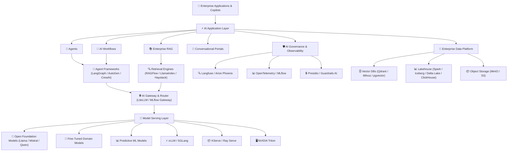
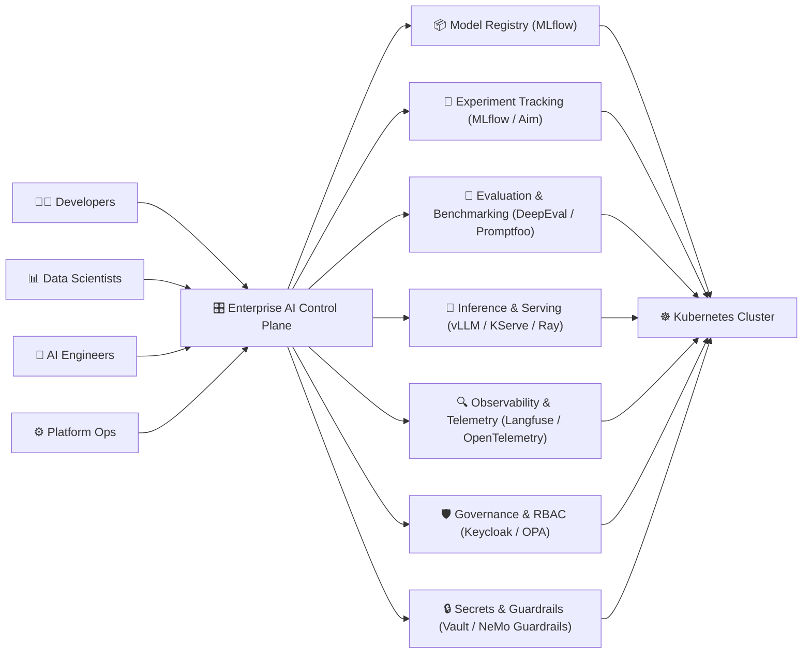
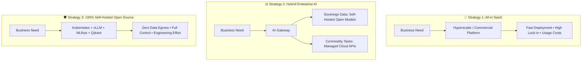

<p align="center">
  
</p>

# 🏢 Awesome Enterprise AI Platform 🚀

<p align="center">
  <a href="https://github.com/ishandutta2007/Awesome-Awesome-Awesome"></a>
  <a href="https://discord.gg/jc4xtF58Ve"></a>
  <a href="https://github.com/ishandutta2007/Awesome-Enterprise-AI-Platform/stargazers"></a>
  <a href="https://github.com/ishandutta2007/Awesome-Enterprise-AI-Platform/network/members"></a>
  <a href="https://github.com/ishandutta2007/Awesome-Enterprise-AI-Platform/blob/main/LICENSE"></a>
  <a href="https://github.com/ishandutta2007"></a>
</p>

---

## 🌟 Overview & Mission

A definitive, SEO-optimized, community-curated directory of **Enterprise AI Platforms**, **Generative AI (GenAI) Platforms**, **MLOps / LLMOps Infrastructure**, **AI Agent Frameworks**, **Enterprise RAG Systems**, and **Open-Source Self-Hosted Stacks** for building, fine-tuning, deploying, governing, and operating production AI at scale.

> 💡 **Open-source software is the primary focus of this repository.** While enterprise commercial SaaS platforms offer turnkey conveniences, open-source building blocks empower organizations to design self-hosted, sovereign-AI, private-cloud, and vendor-neutral architectures that prevent vendor lock-in and ensure strict data sovereignty.

---

### 🧩 Core Capabilities of Enterprise AI Platforms

Modern enterprise AI platforms synthesize multiple specialized architectural capabilities:

* 🤖 **Foundation Models & Generative AI:** Multi-modal LLMs, open-weights models, context caching, and prompt engineering.
* 🧠 **Machine Learning & Predictive Analytics:** Feature stores, supervised/unsupervised training, distributed ML, and AutoML.
* 🧪 **Model Development & Experimentation:** Version control, collaborative notebook environments, parameter tracking, and lineage.
* ⚙️ **Model Training & Fine-Tuning:** LoRA, QLoRA, full fine-tuning, distributed GPU clustering, and checkpointing.
* 🚀 **High-Throughput Model Serving:** PagedAttention inference engines, dynamic batching, vLLM, KServe, and Triton.
* 🔗 **Autonomous AI Agents & Workflows:** Stateful multi-agent collaboration, tool invocation, reflection, and human-in-the-loop controls.
* 📚 **Enterprise RAG & Semantic Search:** Dense vector search, hybrid retrieval, document understanding, and reranking.
* 📊 **Data & Lakehouse Infrastructure:** Scalable SQL query engines, ACID table formats (Iceberg, Delta Lake), and object storage.
* 🧬 **MLOps & LLMOps Lifecycle:** Continuous integration, continuous delivery, pipeline orchestration, and model registries.
* 🔍 **AI Observability & Tracing:** Distributed OpenTelemetry tracing, latency tracking, token usage analytics, and drift monitoring.
* 🛡️ **AI Governance, Privacy & Security:** Role-Based Access Control (RBAC), PII redacting, safety guardrails, and compliance audits.
* 💰 **AI Cost & FinOps Management:** GPU utilization tracking, multi-tenant chargebacks, and inference optimization.
* ☁️ **Hybrid Cloud & Sovereign AI:** Zero-egress private clouds, on-premises data centers, and multi-cloud portability.

---

## 📑 Table of Contents

* [☁️ SaaS / Hosted Commercial Platforms](#️-saas--hosted-commercial-platforms)
* [🌍 Open-Source Ecosystem](#-open-source-ecosystem)
  * [🧪 1. Open-Source End-to-End AI Platforms](#-1-open-source-end-to-end-ai-platforms)
  * [⚙️ 2. Open-Source MLOps Platforms](#️-2-open-source-mlops-platforms)
  * [🤖 3. Open-Source GenAI & LLM Platforms](#-3-open-source-genai--llm-platforms)
  * [🚀 4. Open-Source Model Serving](#-4-open-source-model-serving)
  * [🔗 5. Open-Source AI Agent Platforms](#-5-open-source-ai-agent-platforms)
  * [📚 6. Open-Source RAG & Enterprise Search](#-6-open-source-rag--enterprise-search)
  * [📊 7. Open-Source Data & Analytics Infrastructure](#-7-open-source-data--analytics-infrastructure)
  * [🛡️ 8. Open-Source AI Governance & Observability](#️-8-open-source-ai-governance--observability)
  * [🧠 9. Open-Source AI Evaluation](#-9-open-source-ai-evaluation)
* [☸️ Open-Source AI Infrastructure](#️-open-source-ai-infrastructure)
* [🏗️ Enterprise AI Reference Architecture](#️-enterprise-ai-reference-architecture)
* [🏢 Enterprise AI Control Plane](#-enterprise-ai-control-plane)
* [🔄 Commercial Platform → Open-Source Equivalent](#-commercial-platform--open-source-equivalent)
* [🧩 Fully Open-Source Architecture Blueprint](#-fully-open-source-architecture-blueprint)
* [🔍 Commercial vs Open-Source Comparison](#-commercial-vs-open-source-comparison)
* [⭐ Recommended Open-Source Production Stacks](#-recommended-open-source-production-stacks)
* [🧠 Enterprise AI Platform Layers](#-enterprise-ai-platform-layers)
* [🚧 Key Enterprise Gaps in Open Source](#-key-enterprise-gaps-in-open-source)
* [🎯 Three Enterprise AI Strategies](#-three-enterprise-ai-strategies)
* [🤝 How to Contribute](#-how-to-contribute)
* [⚠️ Disclaimer](#️-disclaimer)
* [⭐ Star History](#-star-history)

---

# ☁️ SaaS / Hosted Commercial Platforms

Commercial and hosted platforms providing integrated AI development, model management, data intelligence, MLOps, GenAI, agentic orchestration, enterprise governance, and scalable cloud infrastructure.

> 📈 **Market Size & Industry Dynamics:** The global Enterprise AI Platform market is estimated at **$38.5 Billion in 2024–2026** and is projected to expand to **$270+ Billion by 2032 (CAGR of ~38%)**. The market structure is currently **moderately fragmented**: the foundation model and hyper-scale compute layer is highly concentrated among major cloud hyperscalers (Microsoft Azure, Amazon AWS, Google Cloud), while the application layer, agentic workflow orchestration, specialized MLOps, and enterprise governance segments remain intensely competitive and fragmented with leading specialized SaaS providers and a rapidly expanding open-source ecosystem.

| Platform | Description | Primary Focus | Company Size (Market Cap / Valuation / Revenue) | Pricing | Free Tier Limit |
| --- | --- | --- | --- | --- | --- |
| [Microsoft Foundry](https://azure.microsoft.com/en-us/products/ai-foundry/) | Microsoft's unified enterprise AI platform for models, agents, tools, evaluation, monitoring, governance and AI application development. | Enterprise AI / Agents | 🏢 ~$3.1T Market Cap ($245B+ Rev) | From $0.15 / 1M input tokens & $0.60 / 1M output tokens (GPT-4o mini serverless API); VM compute from $0.05/hr | 30-day free trial with $200 Azure credits + 55+ always-free services (12 months of popular free services) |
| [NVIDIA AI Enterprise](https://www.nvidia.com/en-us/data-center/products/ai-enterprise/) | Enterprise software stack for developing, deploying and operating AI workloads on NVIDIA infrastructure. | AI Infrastructure | 🏢 ~$3.0T Market Cap ($120B+ Rev) | $1.00 / GPU-hour on cloud marketplaces (pay-as-you-go) or $4,500 / GPU / year subscription | 90-day free trial (evaluation license for business email signups supporting up to 8 GPUs) |
| [Google Vertex AI](https://cloud.google.com/vertex-ai) | Google Cloud's end-to-end AI platform covering foundation models, ML development, agents, evaluation, deployment and governance. | AI/ML Platform | 🏢 ~$2.1T Market Cap ($307B+ Rev) | From $0.075 / 1M input tokens & $0.30 / 1M output tokens (Gemini 1.5 Flash); AutoML training from $2.00/node-hr | 90-day free trial with $300 cloud credits; Google AI Studio free tier: 15 RPM / 1M TPM for Gemini Flash |
| [Amazon Bedrock](https://aws.amazon.com/bedrock/) | Fully managed AWS service for building generative AI applications using foundation models, agents, RAG and enterprise controls. | GenAI / Foundation Models | 🏢 ~$2.0T Market Cap ($575B+ Rev) | From $0.035 / 1M input tokens & $0.14 / 1M output tokens (Amazon Nova Micro) or $0.20 / 1M input tokens (Titan Text) | AWS Free Tier with up to $200 promotional onboarding credits; PartyRock playground has free daily generation limits |
| [Oracle AI](https://www.oracle.com/artificial-intelligence/) | Enterprise AI services integrated with Oracle Cloud and enterprise applications and databases. | Enterprise AI | 🏢 ~$450B Market Cap ($53B+ Rev) | From $0.15 / 1M tokens (Cohere/Llama on OCI Generative AI); OCI Data Science from $0.05 / OCPU-hour | 30-day free trial with $300 cloud credits + Always Free tier (2 Autonomous DBs, up to 4 Ampere A1 OCPUs / 24 GB RAM / 1,500 OCPU-hrs/mo) |
| [Tencent Cloud AI](https://www.tencentcloud.com/products/tiia) | Enterprise AI services and infrastructure across model development and deployment. | Cloud AI | 🏢 ~$420B Market Cap ($86B+ Rev) | From $0.60 / 1M tokens (Hunyuan-Standard); TI Platform inference compute from $0.08 / GPU-hour ($0.03 / core-hour) | Free forever plan (100,000 tokens/month for Hunyuan API) + 30-day TI Platform free trial resource package (200 credits for 365 days) |
| [SAP Business AI](https://www.sap.com/products/artificial-intelligence.html) | AI capabilities integrated across SAP's enterprise applications and business processes. | Business AI | 🏢 ~$260B Market Cap ($34B+ Rev) | From $1.00 - $1.25 per Capacity Unit (SAP AI Core baseline ~352 CUs/month = ~$352/mo) or $500 / 1,000 AI Units/yr | SAP BTP Free Tier (perpetual free plan for SAP AI Core with 1 tenant and restricted compute quotas) OR 90-day sandbox trial |
| [Alibaba Cloud AI](https://www.alibabacloud.com/en/solutions/ai) | Cloud AI ecosystem covering foundation models, model services, ML and enterprise AI applications. | Cloud AI | 🏢 ~$220B Market Cap ($130B+ Rev) | From $0.04 / 1M input tokens & $0.12 / 1M output tokens (Qwen-Turbo); PAI compute from $0.05 / core-hour | 90-day free trial with 70+ million free tokens across Qwen models (1M tokens/model) + $300-$1,700 cloud credit trial (30-60 days) |
| [IBM watsonx](https://www.ibm.com/watsonx) | Enterprise AI platform covering AI development, foundation models, governance and data. | Enterprise AI | 🏢 ~$200B Market Cap ($62B+ Rev) | watsonx.ai Essentials plan starts at $1,050 / month (or pay-as-you-go from $0.15 / 1M tokens for Granite & $0.60 / CUH) | Free Lite plan (perpetual: 1 user, 10 CUH/month, 25,000 capacity units or 250MB storage) OR 30-day trial with 300,000 tokens & $200 IBM Cloud credits |
| [Palantir AIP](https://www.palantir.com/platforms/aip/) | Enterprise AI platform integrating foundation models with organizational data, workflows, agents and operational systems. | AI Applications / Agents | 🏢 ~$95B Market Cap ($2.8B+ Rev) | Starts at ~$25,000 / month (or ~$250,000 / year base commercial pilot via AIP Bootcamps) | Free Developer Tier (perpetual free access on build.palantir.com with capped compute-seconds & storage quotas, single-user) |
| [Dell AI Solutions](https://www.dell.com/en-us/dt/solutions/artificial-intelligence.htm) | Enterprise AI infrastructure and solutions for private and hybrid AI deployments. | Private AI | 🏢 ~$85B Market Cap ($90B+ Rev) | Dell APEX Flex / AI compute subscriptions start at ~$5,885 / month (or PowerEdge AI server leases from ~$1,500 / node / month) | Free Dell Demo Center access (self-guided virtual hands-on AI labs and sandboxes for 14 days per lab session) |
| [Snowflake Cortex](https://www.snowflake.com/en/product/cortex/) | AI capabilities integrated directly into Snowflake for enterprise data, LLM inference, search and AI applications. | Data Cloud + AI | 🏢 ~$55B Market Cap ($3.5B+ Rev) | From $0.12 / 1M tokens (small LLMs) up to $5.10 / 1M tokens; $2.00 / AI Credit for agent services + warehouse compute ($2–$3/credit) | 30-day free trial with $400 in usage credits (+ $40 free inference credits for Cortex Code CLI) |
| [Databricks AI](https://www.databricks.com/product/artificial-intelligence) | AI platform integrated with the Databricks Data Intelligence Platform for model development, GenAI, agents, evaluation, serving and governance. | Data + AI | 🦄 ~$43B Valuation ($2.4B+ Rev) | From $0.07 / DBU (Jobs Compute) to $0.40 - $0.55 / DBU (All-Purpose & Model Serving) + VM infrastructure costs | Free Edition (perpetual free access: 1 serverless workspace, restricted compute) OR 14-day free trial with $400 credits |
| [Baidu AI Cloud](https://cloud.baidu.com/) | Cloud AI platform providing enterprise AI, model services and ML infrastructure. | Cloud AI | 🏢 ~$32B Market Cap ($18B+ Rev) | ERNIE Lite/Speed models at $0; premium models from $0.16 / 1M tokens (ERNIE-3.5) to $0.56 / 1M tokens (ERNIE 5.1); GPU VMs from $0.35/hr | Free forever plan (ERNIE Speed-8K & ERNIE Lite-8K free API calls capped at 50 QPS); new users get 1M free tokens for ERNIE 4.0 for 30 days |
| [HPE Ezmeral AI](https://www.hpe.com/us/en/ai.html) | Enterprise AI infrastructure and software for large-scale AI development and deployment. | AI Infrastructure | 🏢 ~$25B Market Cap ($29B+ Rev) | GreenLake consumption starts from ~$0.08 - $0.15 / core-hour or ~$1,200 / node / month (base flex commitment from ~$3,000/mo) | 14-day interactive test drive / hosted PoC sandbox (up to 5 compute nodes, pre-loaded workloads) |
| [Scale AI](https://scale.com/) | Enterprise AI platform combining data, evaluation, model development and AI application infrastructure. | AI Data / Evaluation | 🦄 ~$13.8B Valuation ($750M+ Rev) | Self-serve labeling from $0.05 / unit (or Scale GenAI Platform base enterprise contract from ~$25,000 / year) | Free tier allowance: 1,000 labeling units and 10,000 images, or 200 free tasks/month; Nucleus free academic tier |
| [Altair RapidMiner](https://altair.com/rapidminer) | Enterprise data analytics and AI platform supporting data preparation, machine learning and AI workflows. | Data Science | 🏢 ~$10.6B Acquired by Siemens ($620M+ Rev) | Starts from ~$2,500 / user / year (Studio base license) or ~$10,000 / year for team deployment | Free Starter Edition (free forever, 1 user, up to 10,000 data rows per process, 1 logical processor) or 30-day full-feature trial |
| [SAS Viya](https://www.sas.com/en_us/software/viya.html) | Enterprise analytics and AI platform covering data science, machine learning, model management, governance and analytics. | Enterprise Analytics | 🏢 ~$10B Valuation ($3.2B+ Rev) | Starts at $0.55 / SAS Unit (SU) per hour on Azure Marketplace pay-as-you-go, or ~$8,000 / user / year for Viya Workbench | 14-day free trial (private SAS-hosted cloud environment with 1GB data upload limit and guided workflows) |
| [Cloudera AI](https://www.cloudera.com/products/machine-learning.html) | Enterprise AI/ML development and deployment environment integrated with the Cloudera data platform. | Enterprise Data + AI | 🏢 ~$5.3B Valuation ($1B+ Rev) | Starts from $0.20 / CCU (Cloudera Compute Unit)/hour for AI Workbench & $0.25 / CCU/hour for AI Inference, or base annual sub from ~$10,000 / yr | 5-day Public Cloud Free Trial (includes pre-built AMP accelerators) OR 60-day Private Cloud evaluation trial |
| [Dataiku](https://www.dataiku.com/) | Enterprise AI and data science platform for collaborative analytics, ML, GenAI and governance. | Enterprise AI / Data Science | 🦄 ~$3.7B Valuation ($250M+ Rev) | Starts from ~$4,000 / month (~$48,000 / year for Discover / Business tier) | Free Edition (perpetual free license for up to 3 users, local single-node install) OR 14-day Cloud free trial (up to 5 users, 4 CPUs, 32 GB RAM) |
| [C3 AI](https://c3.ai/) | Enterprise AI application platform for developing and deploying AI applications across industries and business functions. | Enterprise AI Applications | 🏢 ~$3.5B Market Cap ($310M+ Rev) | Starts at $0.55 / vCPU-hour consumption rate (or $250,000 for standard 3-month production pilot) | 14-day free trial via AWS / Azure Marketplace (or 30-day free trial for C3 Agentic AI Websites) |
| [DataRobot AI Platform](https://www.datarobot.com/platform/) | Enterprise AI platform covering AI development, AutoML, GenAI, deployment, monitoring and governance. | AI/ML + Governance | 🦄 ~$3.0B Valuation ($200M+ Rev) | Starts at ~$50,000 / year (via G-Cloud / cloud marketplace tier) or ~$4,166 / month for baseline team deployment | 30-day self-service SaaS free trial (includes full AutoML modeling workers, up to 15 vector DBs, 1,000 LLM calls) |
| [H2O AI Cloud](https://h2o.ai/platform/) | Enterprise AI platform providing machine learning, AutoML, GenAI, LLM applications and MLOps capabilities. | AI/ML + GenAI | 🦄 ~$1.7B Valuation ($40M+ Rev) | Starts at ~$50,000 / year (or ~$200,000 / year per dedicated GPU-enabled cluster) | 90-day free trial of H2O AI Cloud (no credit card required) or 21-day Driverless AI evaluation license |
| [Weights & Biases](https://wandb.ai/) | AI development and MLOps platform covering experiments, models, datasets, evaluation and production AI workflows. | MLOps | 🦄 ~$1.25B Valuation ($60M+ Rev) | $60 / user / month (Pro plan) | Free Forever plan (1 user seat, 5 GB storage, 1 GB/month Weave data ingestion, unlimited experiment tracking) or 30-day Pro trial |
| [Domino Data Lab](https://domino.ai/platform) | Enterprise data science and AI platform for developing, deploying, governing and managing AI workloads across hybrid infrastructure. | Enterprise Data Science | 🦄 ~$800M Valuation ($50M+ Rev) | Starts at ~$3,000 / user / year or base platform license from ~$36,000 / year | 14-day free trial on Domino Cloud (full enterprise feature access with allocated compute sandbox) |

---

# 🌍 Open-Source Ecosystem

Open-source projects that can collectively reproduce and exceed the capabilities found in proprietary Enterprise AI Platforms.

> 💡 **Modular Architecture:** Unlike monolithic commercial platforms, the open-source ecosystem is **composable and modular**. Organizations can choose best-of-breed components at each layer—orchestrating with Kubernetes, tracking with MLflow, serving with vLLM, building agents with LangGraph, and retrieving through Qdrant or Milvus.

---

## 🧪 1. Open-Source End-to-End AI Platforms

Integrated open-source environments for data science, distributed ML workflows, experiment tracking, pipeline orchestration, and production deployment.

| Project | Description | Best Use |
| --- | --- | --- |
| [MLflow](https://github.com/mlflow/mlflow) [](https://github.com/mlflow/mlflow/stargazers) | Open-source AI engineering platform covering ML lifecycle management, LLMs, agents, evaluation, observability and deployment. | AI/ML Lifecycle |
| [DVC](https://github.com/iterative/dvc) [](https://github.com/iterative/dvc/stargazers) | Data and model version control system with reproducible ML pipeline pipelines. | Data Versioning / Pipelines |
| [Kubeflow](https://github.com/kubeflow/kubeflow) [](https://github.com/kubeflow/kubeflow/stargazers) | Kubernetes-native ecosystem for data science, ML training, pipelines, model serving and AI workloads. | Enterprise AI Platform |
| [Kedro](https://github.com/kedro-org/kedro) [](https://github.com/kedro-org/kedro/stargazers) | Open-source Python framework for creating reproducible, maintainable, and modular data science code. | Data Science Workflows |
| [Metaflow](https://github.com/Netflix/metaflow) [](https://github.com/Netflix/metaflow/stargazers) | Human-friendly Python/R framework for building and operating data science and ML workflows at scale. | Data Science |
| [BentoML](https://github.com/bentoml/BentoML) [](https://github.com/bentoml/BentoML/stargazers) | Unified framework for packaging, containerizing, and orchestrating models into production APIs. | Model Packaging / APIs |
| [H2O-3](https://github.com/h2oai/h2o-3) [](https://github.com/h2oai/h2o-3/stargazers) | Open-source machine-learning platform supporting distributed ML, AutoML, algorithms and enterprise integration. | Machine Learning |
| [Flyte](https://github.com/flyteorg/flyte) [](https://github.com/flyteorg/flyte/stargazers) | Kubernetes-native workflow orchestration platform for concurrent, scalable, and reproducible data and ML workloads. | ML Orchestration |
| [ClearML](https://github.com/clearml/clearml) [](https://github.com/clearml/clearml/stargazers) | Open-source suite covering experiment management, data management, orchestration, pipelines and model serving. | MLOps |
| [ZenML](https://github.com/zenml-io/zenml) [](https://github.com/zenml-io/zenml/stargazers) | Extensible, open-source MLOps framework for creating reproducible, cloud-agnostic ML pipelines. | MLOps |
| [Seldon Core](https://github.com/SeldonIO/seldon-core) [](https://github.com/SeldonIO/seldon-core/stargazers) | Cloud-native model deployment and governance platform for scaling ML models on Kubernetes. | Model Governance / Serving |
| [Polyaxon](https://github.com/polyaxon/polyaxon) [](https://github.com/polyaxon/polyaxon/stargazers) | Platform for building, training, and monitoring deep learning and machine learning workflows on Kubernetes. | ML Platform |
| [Elyra](https://github.com/elyra-ai/elyra) [](https://github.com/elyra-ai/elyra/stargazers) | Visual AI workflow development environment that extends JupyterLab with pipeline editors and component registries. | AI Workflows |
| [Open Data Hub](https://github.com/opendatahub-io/opendatahub-operator) [](https://github.com/opendatahub-io/opendatahub-operator/stargazers) | Open-source AI/ML platform distribution optimized for Kubernetes and OpenShift environments. | Enterprise AI |

---

## ⚙️ 2. Open-Source MLOps Platforms

Specialized engines for pipeline workflow orchestration, data versioning, experiment management, feature stores, and automated continuous delivery.

| Project | Description | Primary Capability |
| --- | --- | --- |
| [Apache Airflow](https://github.com/apache/airflow) [](https://github.com/apache/airflow/stargazers) | Scalable workflow orchestration platform widely used for scheduling complex data and ML workflows. | Data/ML Orchestration |
| [MLflow](https://github.com/mlflow/mlflow) [](https://github.com/mlflow/mlflow/stargazers) | Model lifecycle, experiment tracking, evaluation, registry, deployment and GenAI observability. | MLOps / LLMOps |
| [Prefect](https://github.com/PrefectHQ/prefect) [](https://github.com/PrefectHQ/prefect/stargazers) | Modern resilient workflow orchestration engine designed for data, ML, and AI systems. | Workflow Automation |
| [Dagster](https://github.com/dagster-io/dagster) [](https://github.com/dagster-io/dagster/stargazers) | Data-aware orchestrator for machine learning, analytics, and ETL pipelines with software-defined assets. | Data Orchestration |
| [DVC](https://github.com/iterative/dvc) [](https://github.com/iterative/dvc/stargazers) | Open-source version control system for machine learning projects, datasets, and models. | Data/Model Versioning |
| [Kubeflow](https://github.com/kubeflow/kubeflow) [](https://github.com/kubeflow/kubeflow/stargazers) | Modular Kubernetes-native ML platform ecosystem for training, pipelines, and registries. | Enterprise MLOps |
| [BentoML](https://github.com/bentoml/BentoML) [](https://github.com/bentoml/BentoML/stargazers) | Production model serving, multi-model pipelines, and distributed inference orchestration. | Model Serving / Packaging |
| [Flyte](https://github.com/flyteorg/flyte) [](https://github.com/flyteorg/flyte/stargazers) | Scalable workflow orchestration for mission-critical data and ML pipelines. | ML Pipelines |
| [Feast](https://github.com/feast-dev/feast) [](https://github.com/feast-dev/feast/stargazers) | Open-source feature store for machine learning managing real-time and offline features. | Feature Store |
| [ClearML](https://github.com/clearml/clearml) [](https://github.com/clearml/clearml/stargazers) | Experiment tracking, data versioning, pipeline orchestration, hyperparameter tuning, and serving. | Full MLOps |
| [Aim](https://github.com/aimhubio/aim) [](https://github.com/aimhubio/aim/stargazers) | Open-source, self-hosted AI metadata and experiment tracker designed for rapid exploration. | Experiment Tracking |
| [ZenML](https://github.com/zenml-io/zenml) [](https://github.com/zenml-io/zenml/stargazers) | Framework for reproducible and production-ready ML pipelines across any cloud stack. | MLOps |
| [CML](https://github.com/iterative/cml) [](https://github.com/iterative/cml/stargazers) | Continuous Machine Learning: CI/CD for machine learning projects using GitHub Actions and GitLab CI. | ML CI/CD |

---

## 🤖 3. Open-Source GenAI & LLM Platforms

Platforms, self-hosted developer portals, multi-model gateways, and web workspaces for building and interacting with generative AI and LLMs.

| Project | Description | Best Use |
| --- | --- | --- |
| [Ollama](https://github.com/ollama/ollama) [](https://github.com/ollama/ollama/stargazers) | Local and server model runtime simplifying instant deployment of open foundation models. | Local AI / Serving |
| [Dify](https://github.com/langgenius/dify) [](https://github.com/langgenius/dify/stargazers) | Open-source LLM application platform supporting visual orchestration, multi-agent flows, RAG, and LLMOps. | GenAI Platform |
| [Open WebUI](https://github.com/open-webui/open-webui) [](https://github.com/open-webui/open-webui/stargazers) | Self-hosted, extensible enterprise AI portal and conversational interface supporting local and remote models. | Enterprise AI Portal |
| [RAGFlow](https://github.com/infiniflow/ragflow) [](https://github.com/infiniflow/ragflow/stargazers) | Open-source RAG engine based on deep document understanding and multi-modal parsing. | Enterprise RAG |
| [AnythingLLM](https://github.com/Mintplex-Labs/anything-llm) [](https://github.com/Mintplex-Labs/anything-llm/stargazers) | Full-stack private AI desktop and enterprise web application for chat, documents, and RAG. | Private AI |
| [LiteLLM](https://github.com/BerriAI/litellm) [](https://github.com/BerriAI/litellm/stargazers) | High-performance AI Gateway to call 100+ LLMs with unified OpenAI format, load balancing, and spend tracking. | AI Gateway / LLMOps |
| [Flowise](https://github.com/FlowiseAI/Flowise) [](https://github.com/FlowiseAI/Flowise/stargazers) | Drag & drop visual builder for LLM applications, autonomous agents, and customizable workflows. | AI Applications |
| [LocalAI](https://github.com/mudler/LocalAI) [](https://github.com/mudler/LocalAI/stargazers) | Self-hosted, drop-in replacement REST API compatible with OpenAI specifications for CPU/GPU inference. | Private AI |
| [Text Generation WebUI](https://github.com/oobabooga/text-generation-webui) [](https://github.com/oobabooga/text-generation-webui/stargazers) | Gradio web interface for running and fine-tuning large language models locally. | Model Exploration |
| [Jan](https://github.com/janhq/jan) [](https://github.com/janhq/jan/stargazers) | Open-source, self-hosted offline alternative to commercial AI assistants with local execution. | Private AI Assistant |
| [LibreChat](https://github.com/danny-avila/LibreChat) [](https://github.com/danny-avila/LibreChat/stargazers) | Open-source multi-provider AI platform featuring multi-modal conversations, agents, and artifact support. | Enterprise Chat |
| [FastChat](https://github.com/lm-sys/FastChat) [](https://github.com/lm-sys/FastChat/stargazers) | Open platform for training, serving, and evaluating large language model based chatbots. | LLM Serving & Evaluation |
| [Onyx](https://github.com/onyx-dot-app/onyx) [](https://github.com/onyx-dot-app/onyx/stargazers) | Open-source enterprise search and conversational AI assistant connecting to Google Drive, Slack, Jira, etc. | Enterprise Search |
| [OpenLLM](https://github.com/bentoml/OpenLLM) [](https://github.com/bentoml/OpenLLM/stargazers) | Open-source platform for serving, fine-tuning, and deploying any open LLM in production environments. | LLM Deployment |

---

## 🚀 4. Open-Source Model Serving

Ultra-low-latency, high-throughput inference engines and serving runtimes optimized for modern large language models, embeddings, and GPU clustering.

| Project | Description | Best Use |
| --- | --- | --- |
| [Ollama](https://github.com/ollama/ollama) [](https://github.com/ollama/ollama/stargazers) | Simple, robust model runtime and CLI for running open LLMs locally and in containers. | Developer AI / Local |
| [llama.cpp](https://github.com/ggml-org/llama.cpp) [](https://github.com/ggml-org/llama.cpp/stargazers) | Lightweight inference ecosystem for running LLMs across CPU, Apple Silicon, GPU, and edge devices. | Local / Edge AI |
| [vLLM](https://github.com/vllm-project/vllm) [](https://github.com/vllm-project/vllm/stargazers) | High-throughput, memory-efficient inference engine using PagedAttention for production LLM serving. | LLM Serving |
| [Ray Serve](https://github.com/ray-project/ray) [](https://github.com/ray-project/ray/stargazers) | Distributed, programmable model serving and compute orchestration framework built on Ray. | Distributed AI |
| [SGLang](https://github.com/sgl-project/sglang) [](https://github.com/sgl-project/sglang/stargazers) | High-performance inference engine and structured decoding language for LLMs and complex workflows. | LLM Inference |
| [MLC-LLM](https://github.com/mlc-ai/mlc-llm) [](https://github.com/mlc-ai/mlc-llm/stargazers) | Universal machine learning compiler and high-performance deployment engine across hardware platforms. | Cross-Platform Inference |
| [TensorRT-LLM](https://github.com/NVIDIA/TensorRT-LLM) [](https://github.com/NVIDIA/TensorRT-LLM/stargazers) | Optimized inference library from NVIDIA for state-of-the-art acceleration on NVIDIA GPUs. | GPU Acceleration |
| [NVIDIA Triton](https://github.com/triton-inference-server/server) [](https://github.com/triton-inference-server/server/stargazers) | Production-grade multi-framework inference server optimized for concurrent multi-GPU workloads. | GPU Inference |
| [Hugging Face TGI](https://github.com/huggingface/text-generation-inference) [](https://github.com/huggingface/text-generation-inference/stargazers) | Specialized, production-tested inference server for large language text-generation models. | LLM Serving |
| [BentoML](https://github.com/bentoml/BentoML) [](https://github.com/bentoml/BentoML/stargazers) | Framework for packaging, containerizing, and orchestrating models as production microservices. | Model Deployment |
| [KServe](https://github.com/kserve/kserve) [](https://github.com/kserve/kserve/stargazers) | Kubernetes-native standard model inference platform supporting autoscaling, canary rollouts, and explainability. | Enterprise Model Serving |
| [Hugging Face TEI](https://github.com/huggingface/text-embeddings-inference) [](https://github.com/huggingface/text-embeddings-inference/stargazers) | Blazing fast inference toolkit for deploying embedding and sequence classification models. | Embedding Serving |

---

## 🔗 5. Open-Source AI Agent Platforms

Frameworks and SDKs for engineering autonomous, cyclical, stateful, and tool-augmented multi-agent systems.

| Project | Description | Best Use |
| --- | --- | --- |
| [LangChain](https://github.com/langchain-ai/langchain) [](https://github.com/langchain-ai/langchain/stargazers) | Vast ecosystem and SDK for building composable LLM-powered applications and tool-calling chains. | AI Applications |
| [MetaGPT](https://github.com/geekan/MetaGPT) [](https://github.com/geekan/MetaGPT/stargazers) | Multi-agent framework taking one-line requirements and outputting PRDs, design, and code architectures. | Multi-Agent Systems |
| [AutoGen](https://github.com/microsoft/autogen) [](https://github.com/microsoft/autogen/stargazers) | Advanced framework for creating multi-agent conversational systems and collaborative AI workflows. | Multi-Agent AI |
| [CrewAI](https://github.com/crewAIInc/crewAI) [](https://github.com/crewAIInc/crewAI/stargazers) | Role-playing, autonomous AI agents orchestrating collaborative multi-agent execution. | Multi-Agent Systems |
| [LlamaIndex](https://github.com/run-llama/llama_index) [](https://github.com/run-llama/llama_index/stargazers) | Data and agentic framework for connecting custom enterprise data to LLMs and agents. | RAG / Agents |
| [Agno](https://github.com/agno-agi/agno) [](https://github.com/agno-agi/agno/stargazers) | Lightweight, memory-efficient framework for building autonomous multimodal AI agents with memory and tools. | Agents |
| [LangGraph](https://github.com/langchain-ai/langgraph) [](https://github.com/langchain-ai/langgraph/stargazers) | Framework for building resilient, stateful, cyclical, and human-in-the-loop multi-agent architectures. | Enterprise Agents |
| [DSPy](https://github.com/stanfordnlp/dspy) [](https://github.com/stanfordnlp/dspy/stargazers) | Framework for algorithmically programming and optimizing LM prompts and pipeline weights. | AI Optimization |
| [ChatDev](https://github.com/OpenBMB/ChatDev) [](https://github.com/OpenBMB/ChatDev/stargazers) | Communicative agent ecosystem where virtual software company roles collaborate on tasks. | Multi-Agent Software |
| [Semantic Kernel](https://github.com/microsoft/semantic-kernel) [](https://github.com/microsoft/semantic-kernel/stargazers) | Enterprise SDK for integrating AI models, plugins, semantic memory, and agent orchestration. | Enterprise AI |
| [Mastra](https://github.com/mastra-ai/mastra) [](https://github.com/mastra-ai/mastra/stargazers) | TypeScript agent framework with workflows, memory, RAG, integrations, and observability. | TypeScript AI |
| [Haystack](https://github.com/deepset-ai/haystack) [](https://github.com/deepset-ai/haystack/stargazers) | Production-oriented modular framework for RAG, intelligent search pipelines, and agent systems. | Enterprise AI |
| [PydanticAI](https://github.com/pydantic/pydantic-ai) [](https://github.com/pydantic/pydantic-ai/stargazers) | Type-safe Python framework for production AI agents with rigorous Pydantic validation. | Agent Development |

---

## 📚 6. Open-Source RAG & Enterprise Search

Vector databases, lexical-semantic hybrid search engines, and document-parsing frameworks powering enterprise Retrieval Augmented Generation (RAG).

| Project | Description | Best Use |
| --- | --- | --- |
| [RAGFlow](https://github.com/infiniflow/ragflow) [](https://github.com/infiniflow/ragflow/stargazers) | Full-stack RAG engine focused on document understanding, OCR, and multi-template chunking. | Document AI / RAG |
| [LlamaIndex](https://github.com/run-llama/llama_index) [](https://github.com/run-llama/llama_index/stargazers) | Leading data framework for connecting private enterprise data stores with LLMs. | Enterprise Knowledge |
| [Milvus](https://github.com/milvus-io/milvus) [](https://github.com/milvus-io/milvus/stargazers) | Highly scalable, distributed cloud-native vector database for billion-scale search workloads. | Vector Search |
| [Qdrant](https://github.com/qdrant/qdrant) [](https://github.com/qdrant/qdrant/stargazers) | High-performance vector database with advanced payload filtering and production reliability. | Vector Search |
| [Chroma](https://github.com/chroma-core/chroma) [](https://github.com/chroma-core/chroma/stargazers) | AI-native open-source embedding database for rapid prototyping and LLM memory. | Embedding DB |
| [Haystack](https://github.com/deepset-ai/haystack) [](https://github.com/deepset-ai/haystack/stargazers) | Modular retrieval, re-ranking, and question-answering pipeline framework. | Enterprise Search |
| [pgvector](https://github.com/pgvector/pgvector) [](https://github.com/pgvector/pgvector/stargazers) | PostgreSQL open-source extension for vector similarity search with IVFFlat and HNSW indexing. | PostgreSQL AI |
| [Weaviate](https://github.com/weaviate/weaviate) [](https://github.com/weaviate/weaviate/stargazers) | Open-source vector database and semantic search engine with hybrid search and modular ML models. | RAG / Hybrid Search |
| [OpenSearch](https://github.com/opensearch-project/OpenSearch) [](https://github.com/opensearch-project/OpenSearch/stargazers) | Community-driven open-source search engine with k-NN vector indexing and lexical retrieval. | Enterprise Search |
| [LanceDB](https://github.com/lancedb/lancedb) [](https://github.com/lancedb/lancedb/stargazers) | Developer-friendly serverless vector database built on the columnar Lance format. | Serverless Vector DB |
| [Vespa](https://github.com/vespa-engine/vespa) [](https://github.com/vespa-engine/vespa/stargazers) | Full-featured enterprise search engine supporting vector, lexical, structured search, and real-time ranking. | Large-Scale Search |
| [Apache Solr](https://github.com/apache/solr) [](https://github.com/apache/solr/stargazers) | Enterprise search platform built on Apache Lucene with robust scaling and text retrieval. | Enterprise Search |

---

## 📊 7. Open-Source Data & Analytics Infrastructure

Analytical query engines, lakehouse table formats, DataFrame tools, and object storage underpinning enterprise AI training and retrieval.

| Project | Description | Equivalent Enterprise Layer |
| --- | --- | --- |
| [MinIO](https://github.com/minio/minio) [](https://github.com/minio/minio/stargazers) | High-performance, S3-compatible enterprise object storage for AI training and unstructured data. | AI Data Storage |
| [ClickHouse](https://github.com/ClickHouse/ClickHouse) [](https://github.com/ClickHouse/ClickHouse/stargazers) | Ultra-fast column-oriented database management system for real-time analytical reporting. | Analytics Warehouse |
| [Apache Spark](https://github.com/apache/spark) [](https://github.com/apache/spark/stargazers) | Unified distributed engine for large-scale data analytics, ETL processing, and distributed ML. | Databricks Equivalent |
| [DuckDB](https://github.com/duckdb/duckdb) [](https://github.com/duckdb/duckdb/stargazers) | In-process SQL OLAP database management system optimized for analytical queries on dataframes. | Local Analytics |
| [Polars](https://github.com/pola-rs/polars) [](https://github.com/pola-rs/polars/stargazers) | Blazingly fast multi-threaded DataFrame library implemented in Rust with lazy query optimization. | Data Processing |
| [PostgreSQL](https://github.com/postgres/postgres) [](https://github.com/postgres/postgres/stargazers) | World's most advanced open-source relational database and foundational AI application data layer. | Enterprise Database |
| [Apache Arrow](https://github.com/apache/arrow) [](https://github.com/apache/arrow/stargazers) | Cross-language development platform for in-memory data, zero-copy reads, and columnar analytics. | Data Infrastructure |
| [Apache Druid](https://github.com/apache/druid) [](https://github.com/apache/druid/stargazers) | High-performance, real-time analytics database designed for sub-second event-driven queries. | Real-Time Analytics |
| [dbt Core](https://github.com/dbt-labs/dbt-core) [](https://github.com/dbt-labs/dbt-core/stargazers) | SQL-first data transformation tool for building clean, reliable analytics pipelines. | Data Transformation |
| [Trino](https://github.com/trinodb/trino) [](https://github.com/trinodb/trino/stargazers) | Fast distributed SQL query engine for big data analytics across heterogeneous data stores. | Data Cloud / Lakehouse |
| [Apache Iceberg](https://github.com/apache/iceberg) [](https://github.com/apache/iceberg/stargazers) | Open table format for huge analytical datasets with ACID transactions and schema evolution. | Lakehouse |
| [Delta Lake](https://github.com/delta-io/delta) [](https://github.com/delta-io/delta/stargazers) | Open storage layer that brings ACID transactions and reliability to Apache Spark lakehouses. | Lakehouse |
| [Apache Pinot](https://github.com/apache/pinot) [](https://github.com/apache/pinot/stargazers) | Distributed OLAP datastore purpose-built for low-latency user-facing real-time analytics. | Real-Time Analytics |

---

## 🛡️ 8. Open-Source AI Governance & Observability

Tools for full-stack LLM tracing, evaluation, guardrails, safety enforcement, PII anonymization, and data quality monitoring.

| Project | Description | Primary Capability |
| --- | --- | --- |
| [Langfuse](https://github.com/langfuse/langfuse) [](https://github.com/langfuse/langfuse/stargazers) | Open-source LLM engineering platform covering observability, metrics, prompt management, and evals. | LLMOps / Tracing |
| [MLflow](https://github.com/mlflow/mlflow) [](https://github.com/mlflow/mlflow/stargazers) | Comprehensive AI observability, evaluation, model lifecycle, governance, and AI gateway. | AI Governance / LLMOps |
| [Great Expectations](https://github.com/great-expectations/great_expectations) [](https://github.com/great-expectations/great_expectations/stargazers) | Data quality and validation framework to prevent pipeline degradation and data drift. | Data Governance |
| [Arize Phoenix](https://github.com/Arize-ai/phoenix) [](https://github.com/Arize-ai/phoenix/stargazers) | AI observability and evaluation platform for tracing, evaluations, embeddings, and drift detection. | AI Observability |
| [Presidio](https://github.com/microsoft/presidio) [](https://github.com/microsoft/presidio/stargazers) | Context-aware API and framework for detecting and anonymizing personally identifiable info (PII). | Privacy / PII |
| [Evidently](https://github.com/evidentlyai/evidently) [](https://github.com/evidentlyai/evidently/stargazers) | Open-source ML and AI evaluation and monitoring framework for model degradation and data drift. | Model Monitoring |
| [OpenTelemetry](https://github.com/open-telemetry/opentelemetry-collector) [](https://github.com/open-telemetry/opentelemetry-collector/stargazers) | Vendor-neutral telemetry collection infrastructure for distributed traces, metrics, and logs. | Observability |
| [Guardrails AI](https://github.com/guardrails-ai/guardrails) [](https://github.com/guardrails-ai/guardrails/stargazers) | Framework for adding structured validation, safety checks, and semantic controls to LLM outputs. | AI Safety / Guardrails |
| [NeMo Guardrails](https://github.com/NVIDIA-NeMo/Guardrails) [](https://github.com/NVIDIA-NeMo/Guardrails/stargazers) | Programmable guardrails for conversational systems to enforce topic boundaries and output safety. | AI Safety |
| [WhyLabs whylogs](https://github.com/whylabs/whylogs) [](https://github.com/whylabs/whylogs/stargazers) | Statistical data and ML profiling library for continuous monitoring and drift detection. | Data Monitoring |

---

## 🧠 9. Open-Source AI Evaluation

Standardized testing suites, red-teaming utilities, benchmark runners, and evaluation frameworks for LLMs and agent systems.

| Project | Description | Best Use |
| --- | --- | --- |
| [MLflow](https://github.com/mlflow/mlflow) [](https://github.com/mlflow/mlflow/stargazers) | Evaluation and monitoring for ML models, LLMs, prompts, and agentic multi-turn systems. | Enterprise AI |
| [promptfoo](https://github.com/promptfoo/promptfoo) [](https://github.com/promptfoo/promptfoo/stargazers) | CLI and library for testing LLM outputs, red-teaming, prompt injection defenses, and regressions. | AI Testing / Red Teaming |
| [OpenAI Evals](https://github.com/openai/evals) [](https://github.com/openai/evals/stargazers) | Framework for evaluating LLMs and systems using automated benchmarks and custom datasets. | Model Evaluation |
| [DeepEval](https://github.com/confident-ai/deepeval) [](https://github.com/confident-ai/deepeval/stargazers) | Production-grade open-source LLM evaluation framework with 14+ specialized metrics. | LLM Evaluation |
| [Ragas](https://github.com/explodinggradients/ragas) [](https://github.com/explodinggradients/ragas/stargazers) | Evaluation framework specialized for Retrieval Augmented Generation (RAG) pipelines. | RAG Evaluation |
| [EleutherAI LM Eval Harness](https://github.com/EleutherAI/lm-evaluation-harness) [](https://github.com/EleutherAI/lm-evaluation-harness/stargazers) | Standardized framework for evaluating autoregressive language models on 200+ benchmarks. | LLM Benchmarking |
| [TruLens](https://github.com/truera/trulens) [](https://github.com/truera/trulens/stargazers) | Evaluation and tracking tool to measure hallucination, relevance, and toxicity in LLM apps. | AI Evaluation |

---

# ☸️ Open-Source AI Infrastructure

### ☸️ Kubernetes
[Kubernetes](https://github.com/kubernetes/kubernetes) provides the bedrock container orchestration layer for modern cloud-native, on-premises, and hybrid enterprise AI clusters.

```text
Enterprise AI Platform
        │
        ↓
    Kubernetes
        │
 ┌──────┼────────┐
 ↓      ↓        ↓
ML     GenAI    Data
│       │        │
↓       ↓        ↓
MLflow KServe   Spark
│       │        │
└───────┼────────┘
        ↓
      GPUs
```

### ⚡ Ray
[Ray](https://github.com/ray-project/ray) delivers distributed computing frameworks essential for:
* 🏋️ Distributed multi-node training and fine-tuning
* 🚀 Scalable model serving (Ray Serve)
* ⚡ High-throughput data preprocessing and batch scoring
* 🎯 Hyperparameter optimization (Ray Tune)
* 🤖 Reinforcement Learning (RLlib) & Multi-Agent orchestration

### 📦 KServe & NVIDIA Triton
* [KServe](https://github.com/kserve/kserve) establishes a Kubernetes-native model serving architecture with serverless autoscaling (Knative), canary rollouts, and multi-model routing.
* [NVIDIA Triton](https://github.com/triton-inference-server/server) powers optimized hardware inference across concurrent CPU, GPU, and heterogeneous accelerators.

---

# 🏗️ Enterprise AI Reference Architecture

A modern enterprise AI platform is structured in interconnected conceptual tiers:



---

# 🏢 Enterprise AI Control Plane

Commercial enterprise platforms increasingly unify development, deployment, security, and governance under a centralized control plane. A modular open-source stack achieves this through interoperable protocols:



---

# 🔄 Commercial Platform → Open-Source Equivalent

The following architectural mappings highlight how open-source building blocks map to commercial vendor ecosystems:

| Commercial Platform | Possible Open-Source Equivalent Stack |
| --- | --- |
| **Microsoft Foundry** | Kubeflow + MLflow + KServe + LangGraph + LiteLLM + OpenTelemetry |
| **Google Vertex AI** | Kubeflow + MLflow + Ray + KServe + vLLM + Kubernetes |
| **Amazon Bedrock** | LiteLLM + vLLM + KServe + LangGraph + LocalAI + Kubernetes |
| **Databricks AI** | Apache Spark + MLflow + Ray + Apache Iceberg / Delta Lake + Kubernetes |
| **Snowflake Cortex** | PostgreSQL / ClickHouse + MLflow + vLLM + Qdrant + Trino |
| **C3 AI** | Dify + LangGraph + MLflow + Spark + Trino + Enterprise Data Stack |
| **DataRobot AI Platform** | MLflow + Kubeflow + H2O-3 + AutoML Frameworks + KServe |
| **H2O AI Cloud** | H2O-3 + MLflow + Kubeflow + KServe + vLLM |
| **SAS Viya** | Kubeflow + MLflow + Apache Spark + JupyterLab + KServe |
| **Domino Data Lab** | Kubeflow + MLflow + JupyterLab + Kubernetes + KServe + Ray |
| **IBM watsonx** | Kubeflow + MLflow + Open WebUI / Dify + KServe + Presidio |
| **Dataiku** | JupyterLab + MLflow + Apache Airflow / Dagster + dbt Core + Kubernetes |
| **Palantir AIP** | Dify + LangGraph + MLflow + RAGFlow + Qdrant + Enterprise Data Stack |

---

# 🧩 Fully Open-Source Architecture Blueprint

A complete blueprint for a self-hosted, sovereign enterprise AI stack:

```text
                     Enterprise Users & Applications
                                   │
                                   ↓
                     ┌───────────────────────────┐
                     │  Enterprise Web AI Portal │
                     │   (Open WebUI / Dify)     │
                     └─────────────┬─────────────┘
                                   ↓
                     AI Application & Agent Layer
                                   │
              ┌────────────────────┼────────────────────┐
              ↓                    ↓                    ↓
         AI Agents                RAG              Workflows
    (LangGraph / CrewAI)  (RAGFlow / LlamaIndex)    (Airflow)
              │                    │                    │
              └────────────────────┼────────────────────┘
                                   ↓
                         AI Routing & Gateway
                         (LiteLLM Proxy API)
                                   │
                     ┌─────────────┴─────────────┐
                     ↓                           ↓
             Open Source Models           External Cloud APIs
           (Llama / Qwen / DeepSeek)     (Azure / Vertex / Bedrock)
                     │
                     ↓
             High-Speed Serving
              (vLLM / SGLang)
                     │
                     ↓
             Cluster Orchestration
              (Kubernetes / Ray)
                     │
            ┌────────┼────────┐
            ↓        ↓        ↓
         KServe    MLflow   GPU Cluster
            │        │
            └────────┼────────┘
                     ↓
             Enterprise Data Lakehouse
                     │
          ┌──────────┼──────────┐
          ↓          ↓          ↓
     PostgreSQL   Object      Vector DB
    (with vector) Storage   (Qdrant/Milvus)
                  (MinIO)
```

---

# 🔍 Commercial vs Open-Source Comparison

| Enterprise Capability | SaaS / Hosted Cloud Platforms | Self-Hosted Open-Source Stack |
| :--- | :---: | :---: |
| 🛠️ **AI/ML Development** | ✅ Turnkey Managed | ✅ Modular & Flexible |
| 🤖 **Generative AI & LLMs** | ✅ Fully Managed APIs | ✅ Full Weights Control |
| 🧠 **Foundation Models** | ✅ Hosted Proprietary + Open | ✅ Fully Sovereign Open Models |
| ⚙️ **Model Training & Fine-Tuning** | ✅ Managed GPU Clusters | ✅ Full Hardware Optimization |
| 🎯 **AutoML Capabilities** | ✅ Native GUI Tooling | ✅ Open Frameworks (H2O, FLAML) |
| 📦 **Model Registry** | ✅ Integrated | ✅ Comprehensive (MLflow) |
| 🚀 **Model Serving & Autoscaling** | ✅ Serverless Endpoints | ✅ Extreme Throughput (vLLM, KServe) |
| 🔗 **Agent Orchestration** | ✅ Cloud Copilots | ✅ Flexible (LangGraph, AutoGen) |
| 📚 **Enterprise RAG** | ✅ Managed Services | ✅ Full Chunking & Embedding Control |
| 🔬 **Experiment Tracking** | ✅ Proprietary Dashboards | ✅ Industry-Standard (MLflow, Aim) |
| 🎯 **AI Evaluation & Benchmarking** | ✅ Cloud Eval Suites | ✅ Deep Metrics (DeepEval, Promptfoo) |
| 🔍 **Full-Stack Observability** | ✅ Integrated CloudWatch/Stackdriver | ✅ Open Standards (OpenTelemetry, Langfuse) |
| 🛡️ **AI Governance & Guardrails** | ✅ Turnkey Policy Engines | ⚠️ Requires Stack Integration |
| 👥 **Enterprise RBAC & Auth** | ✅ Pre-configured SSO / IAM | ✅ OpenID Connect / OAuth2 / Keycloak |
| 🏢 **Multi-Tenancy** | ✅ Managed Isolation | ⚠️ Kubernetes Namespace / Quotas |
| 📜 **Compliance & Certifications** | ✅ SOC2, HIPAA, FedRAMP Ready | ⚠️ Self-Certified Infrastructure |
| 🖥️ **GPU Hardware Management** | ✅ Fully Abstracted | ❌ Dedicated Infrastructure Engineering |
| 📈 **Elastic Auto-Scaling** | ✅ Automatic Cloud Scale | ⚠️ Configured via HPA / KEDA |
| 🔒 **Data Sovereignty & Privacy** | ⚠️ Subject to Cloud Provider Terms | ✅ 100% On-Prem / Air-Gapped Ready |
| 🚫 **Zero Vendor Lock-In** | ❌ High Vendor Coupling | ✅ Complete Portability |
| 💰 **Cost Structure** | 💳 Pay-per-Token / Cloud Markup | 💡 Direct Infrastructure / Hardware CapEx |

---

# ⭐ Recommended Open-Source Production Stacks

### 🥇 1. Sovereign Enterprise AI Platform
* **Foundation:** Kubernetes + Ray Cluster
* **ML Lifecycle:** Kubeflow + MLflow
* **Model Serving:** vLLM + KServe
* **Agents & RAG:** LangGraph + RAGFlow + Qdrant
* **Observability & Governance:** OpenTelemetry + Langfuse + Presidio
* **Best For:** Regulated industries, financial services, healthcare, defense, and data-sovereign organizations.

### 🥈 2. Enterprise GenAI & Copilot Hub
* **Frontend Portal:** Open WebUI or Dify
* **Gateway:** LiteLLM Proxy (spend limits, key rotation, failover)
* **Inference Engine:** vLLM
* **Knowledge Store:** Qdrant or Milvus Vector DB
* **Monitoring:** Langfuse + Phoenix
* **Best For:** Enterprise internal chatbots, automated document processing, and developer copilots.

### 🥉 3. Enterprise MLOps Pipeline Stack
* **Orchestration:** Apache Airflow or Prefect
* **Model Registry & Tracking:** MLflow
* **Feature Store:** Feast
* **Data Processing:** Apache Spark + DuckDB
* **Serving:** KServe + Triton Inference Server
* **Best For:** Large data science organizations operating traditional machine learning alongside deep learning.

---

# 🧠 Enterprise AI Platform Layers

A comprehensive enterprise AI architecture spans nine distinct operational tiers:

```text
┌─────────────────────────────────────────────────────────────┐
│ 1. AI Applications: Copilots, Portals, BI Assistants        │
├─────────────────────────────────────────────────────────────┤
│ 2. Agent Layer: LangGraph, AutoGen, CrewAI, Workflows       │
├─────────────────────────────────────────────────────────────┤
│ 3. Enterprise RAG: Document Parsing, Hybrid Vector Search   │
├─────────────────────────────────────────────────────────────┤
│ 4. Model Catalog: Open Weights, Domain-Adapted Fine-Tunes    │
├─────────────────────────────────────────────────────────────┤
│ 5. Serving & Inference APIs: vLLM, SGLang, Triton, KServe   │
├─────────────────────────────────────────────────────────────┤
│ 6. AI Gateway: LiteLLM, Rate Limiting, Cost Auditing        │
├─────────────────────────────────────────────────────────────┤
│ 7. MLOps / LLMOps: MLflow, Evaluation, Prompt Engineering   │
├─────────────────────────────────────────────────────────────┤
│ 8. Governance & Security: Guardrails, Presidio PII, RBAC    │
├─────────────────────────────────────────────────────────────┤
│ 9. Data & Infrastructure: Kubernetes, Spark, Iceberg, GPUs  │
└─────────────────────────────────────────────────────────────┘
```

---

# 🚧 Key Enterprise Gaps in Open Source

1. **Unified Management Plane:** Commercial platforms like Microsoft Foundry provide single-pane-of-glass dashboards for models, agents, evaluation, security, and RBAC. Open-source implementations require integrating multiple distinct tools.
2. **Abstracted GPU Infrastructure:** Cloud SaaS handles GPU hardware failure, cluster networking, and dynamic provisioning. Self-hosted deployments require expert Kubernetes and GPU hardware operations.
3. **Turnkey Governance & Compliance:** Commercial suites deliver out-of-the-box SOC2, HIPAA, and ISO audit logging. Open-source stacks necessitate custom policy orchestration and compliance architecture.
4. **Unified Cost & Token Accounting:** Tracking multi-tenant GPU and token expenses across business units requires integrating tools like LiteLLM, OpenCost, and internal billing adapters.
5. **Enterprise Support & SLAs:** Proprietary platforms back availability with enterprise SLAs and 24/7 dedicated support teams, whereas open-source systems rely on internal engineering teams or commercial support vendors.

---

# 🎯 Three Enterprise AI Strategies



---

# 🤝 How to Contribute

Contributions to this directory are warmly encouraged! 🎉

Please consider submitting additions for:
* 🌟 Production-ready open-source Enterprise AI and MLOps platforms
* 🚀 High-performance model-serving runtimes and inference engines
* 🔗 Autonomous AI agent frameworks and multi-agent coordination libraries
* 📚 Next-generation RAG, document parsing, and semantic search tools
* 🛡️ AI governance, safety guardrails, PII filters, and red-teaming frameworks
* 📊 Open data infrastructure, lakehouse engines, and vector databases

When contributing, please ensure:
1. The project has active ongoing maintenance and clear open-source licensing.
2. The submission has genuine production relevance to enterprise architectures.
3. Add entries to the corresponding category maintaining star counts and table schemas.

---

# ⚠️ Disclaimer

This repository is an educational, research, and technical reference guide. The inclusion of any company, commercial product, or open-source framework does not constitute an endorsement. Commercial pricing, licensing models, feature sets, and terms of service change frequently. Always consult official documentation and enterprise sales agreements before architecting production workloads.

---

##  Star History
[](https://star-history.dera.page/#ishandutta2007/Awesome-Enterprise-AI-Platform&type=date&legend=top-left)

---

**Last updated: September 2026**
